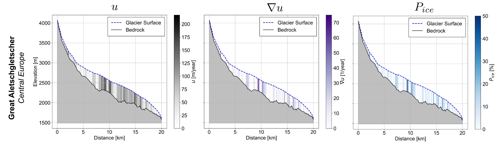

```{note}
This part of the documentation is still under development.
```
# Mass balance

## Accumulation

## Melt

## Debris: CALCULATEDEBRISMELT.pro

### Description 
This procedure models the effect of supraglacial debris on glacier melt. If the setting `debris_supraglacial` is set to `"y"`, the procedure calculates the melt reduction due to debris cover by reading the debris thickness and debris fraction. It identifies debris-covered ice where the surface type is `"ice"`, the temperature exceeds the melting threshold, and debris exists.  

The procedure then assigns a debris reduction factor based on predefined debris thickness categories and adjusts melt rates accordingly. It accounts for:
- **Debris-covered ice** (reduced melt based on `debris_type_red`)  
- **Bare ice** (melting normally)  
- **Ponded/cliff areas** (enhanced melting based on `debris_pond_enhancementfactor`)  

The melt calculations are summed and stored in `imelt(ye)`, normalized by the glacier area. If the `time_resolution` setting is `"daily"`, the computed melt values are stored in `icemel(ii)`.  

### Inputs 
| Name                          | Type       | Content  |  
|-------------------------------|-----------|------------------------------------------------------|  
| `debris_supraglacial`         | String    | Flag to enable/disable debris influence on melt (`"y"` or `"n"`).  Setting |  
| `sur`                         | Numeric Array | Surface classification array (0 = ice, other values for snow/firn).  |  
| `tg`                          | Numeric Array | Temperature array at each grid cell.  |  
| `t_melt`                      | Numeric    | Temperature threshold for melting.  |  
| `debris_thick`                | Numeric Array | Debris thickness at each grid point.  |  
| `debris_frac`                 | Numeric Array | Fraction of surface covered by debris.  |  
| `debris_type_th`              | Numeric Array | Reference debris thickness values for classification.  |  
| `debris_type_red`             | Numeric Array | Reduction factors corresponding to `debris_type_th`.  |  
| `debris_ponddens`             | Numeric Array | Fraction of surface covered by melt ponds or cliffs.  |  
| `debris_pond_enhancementfactor` | Numeric | Enhancement factor for pond/cliff melt.  |  
| `mel`                         | Numeric Array | Ice melt array at each grid point (to be modified).  |  
| `imelt`                       | Numeric Array | Integrated melt accumulation per year.  |  
| `ye`                          | Integer    | Year index for `imelt` storage.  |  
| `ar_gl`                       | Numeric    | Total glacier area (for normalization).  |  
| `area`                        | Numeric Array | Area of each grid cell.  |  
| `time_resolution`             | String    | Temporal resolution of the model (`"daily"` or other). Setting |  
| `icemel`                      | Numeric Array | Stores computed melt values if `time_resolution` is `"daily"`.  |  
| `write_mb_elevationbands`     | String    | Flag to store debris reduction factors for mass balance calculations (`"y"` or `"n"`). Setting  |  

### Outputs 
- **Melt calculations adjusted for debris cover**  
  - `imelt(ye)`: Updated cumulative melt array for the given year, normalized by glacier area.  
  - `icemel(ii)`: Daily melt values if `time_resolution` is `"daily"`.  
- **Debris reduction factors (optional)**  
  - `debris_red_factor(ii)`: Stores assigned reduction factors for mass balance elevation bands if `write_mb_elevationbands` is `"y"`.  

### Loop
Within loop 14, meltmodel '1'

## Refreezing

## Firnicetemperature

### Description
Firn ice temperatures in GloGEM are computed for each elevation band and vertical layer using heat conduction.

$$
\begin{equation}
\frac{\delta T_{i,m}}{\delta t} = \frac{1}{c_{h}\cdot\rho}\frac{\delta}{\delta z}\left(\kappa\frac{\delta T_{i,m}}{\delta z}\right)
\end{equation}
$$

where $c_{h}$ is the heat capacity of ice, $\kappa$ is the thermal conductivity and $\rho$ the firn/ice density. The temperature of the uppermost layer, $T_{i,m}$, is assumed to equal the monthly mean air temperature. To reduce computational, costs, the model's resolution decreases with depth where temperature fluctuations are assumed to be minimal: 1 m for the uppermost 10 m, 5 m for the next 50 m, and 20 m for the following 200 m. At the lower boundary, a geothermal heat flux is applied based on a gridded data product by Lucazeau (2019).

Refreezing and the associated latent heat transfer from percolating water follow the previously described scheme. However, before entering the ice, the water input is reduced, as ice is considered mostly impermeable. However, we assume that in heavily crevassed areas, permeability increases sufficiently to impact the englacial temperature, as fractures provide pathways for liquid water infiltration. Crevassed regions are approximated by calculating velocity gradients. In a first step, the horizontal velocity of ice, $u_i$, is calculated using the Shallow Ice Approximation:

$$
\begin{equation}
u_i = \frac{2A}{n+1} \left( \rho g \sin \theta_i \right)^n H_i^{n+1}
\end{equation}
$$

where $A$ is the flow rate factor, which depends on the ice temperature, and $n$ is the Glen's flow law exponent. The terms $\rho$ and $g$ denote the ice density and gravitational acceleration, respectively. The surface slope is given by $\sin \theta_i$, and $H_i$ represents the ice thickness. This formulation captures the deformation of ice under its own weight, driven by the surface slope and the thickness of the ice.

The velocity gradient $\nabla_{u}$ is computed using finite differences and subsequently normalized as follows:

$$
\begin{equation}
\nabla_{u,\text{normalized}} = \frac{\nabla_{u} - \min(\nabla_{u})}{\max(\nabla_{u}) - \min(\nabla_{u})}
\end{equation}
$$

Positive velocity gradients serve as a proxy for extension and, consequently, crevassing, which is then used to compute a permeability factor governing the amount of liquid water entering the ice. The step-by-step computations for Great Aletschgletscher are shown in this example figure, illustrating the progression from ice velocities to velocity gradients and ultimately to the derived permeability factor. Note that the original factor, which ranges between 0 and 1, is halved, limiting the maximum permeability to 50%, as fully permeable ice is not expected.



### Inputs

### Outputs

## Adapting snow reservoir

## Catchment discharge

## Adapting surface types

## Storing day variables
