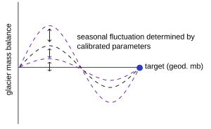

# Calibration on Geodetic Mass Balance and Snowlines (Snowline Calibration)

In this calibration, the targets are:
- The **geodetic glacier mass balance** over a defined time period, and  
- The **"daily" median snowline altitude**.

Currently, this calibration is **only applicable for High Mountain Asia**, as snowline data is available for this region. However, it can be extended to other regions when suitable datasets become available.

---

## Data Sources

- **Geodetic Mass Balance**: [Hugonnet et al., 2021](https://www.nature.com/articles/s41586-021-03436-z), for the period **2000–2020**  
- **Mean Snowline Altitude & Standard Deviation**: [Loibl et al., 2023](https://doi.pangaea.de/10.1594/PANGAEA.953619)
, for the period **2000–2020**

---

## Calibration Overview

Unlike the original calibration, this method does **not loop through calibration phases sequentially**, but instead **loops through them simultaneously**:

### Calibration Parameters:

1. **`cprec`** — Precipitation correction factor  
2. **`ddf`** — Melt factor (for snow)  
3. **`toff`** — Temperature offset (bias)

Each glacier is calibrated individually, using the **reanalysis product specified** in the `input.pro` file. `ddf` boundaries can be defined either in `input.pro` or in the reanalysis-specific `regional_parameter` file. `cprec` boundaries and step size are defined in the code itself (after entering the `loop over calibration phase`). To run the model one currently needs these four codes:
- `input_snow.pro`: settings
- `glogem.pro`: main calibration code
- `read_snowlinedata.pro`: procedure to read in the snowline data
- `compare_snowline_rmse.pro`: procedure that calculates the weighted rmse of the observed and modelled snowline 

---

## Calibration Procedure

### Step 1: Loop Through `cprec` and `ddf`

- Define a **range and step size** for `cprec`, e.g., **[0.8 – 2.5]** with a step size of **0.2**.
- For each value of `cprec`, the model searches for a matching `ddf` within its specified range.
- If the **upper or lower boundary** of the `ddf` range is reached, `toff` is activated and adjusted accordingly.
- The goal here is to find a parameter set that **matches the geodetic mass balance**.

### Step 2: Match with Snowline Altitudes

- For all combinations that match the geodetic mass balance, the model calculates the **weighted RMSE** between the **observed** and **modelled snowline altitudes**.
- The calibration selects the parameter combination with the **lowest weighted RMSE** as the best fit.

---

## Notes

- The calibration process explores all combinations simultaneously, rather than in sequence.
- Parameters `cprec` and `ddf` are bounded; only when those bounds are hit does `toff` come into play.
- **Weighted RMSE** uses snowline standard deviation as a weight to reflect uncertainty.
- Final selection depends on **both mass balance and snowline fit**.

---

## To Do

- [ ] Add information on the **calibration stop criteria**
- [ ] Include **two figures** illustrating the calibration concept and parameter search loop

## snowline data format

## Snowline: `READ_SNOWLINEDATA.pro`

Description

This procedure reads observed snowline data from a region-specific file and extracts the metadata and numerical values necessary for calibration of glacier-specific snowline models. It identifies the appropriate snowline data file based on the provided region and calibration period, then reads and parses the content into structured arrays. 

The procedure is stored in the /read folder.

The procedure performs the following key tasks:

- Constructs the snowline data filename based on input parameters.
- Reads and parses metadata and numerical content from the file.
- Splits each line of data into components representing year, day of year (DOY), snowline elevation, standard deviation.
- Extracts glacier ID and calibration periods for model fitting.
- Populates output arrays with year, DOY, snowline observations, and their uncertainty.

These outputs are used in subsequent glacier modeling routines to calibrate and validate snowline-based mass balance models.

---

Inputs

| Name                          | Type           | Content                                                                 |
|-------------------------------|----------------|-------------------------------------------------------------------------|
| `dir`                         | String         | Path to the base directory containing snowline data subfolders.         |
| `dir_region`                  | String Array   | Array mapping regions to directory names.                               |
| `region_loop_data`            | String Array   | 2D array containing region-specific metadata and codes.                 |
| `calibrate_glacierspecific_period` | String    | Calibration period in format `"YYYY_YYYY"` used to locate the correct file. |

---

Outputs

| Name                    | Type           | Content                                                                 |
|-------------------------|----------------|-------------------------------------------------------------------------|
| `year_obs`              | Numeric Array  | Array of observation years extracted from snowline data.                |
| `doy_obs`               | Numeric Array  | Day-of-year values for each observation.                                |
| `snowlineday_obs`       | Numeric Array  | Observed snowline elevation values.                                     |
| `snowline_stdev_obs`    | Numeric Array  | Standard deviation of observed snowline values.                         |
| `calisnow_p0`           | Numeric Array  | Calibration start year for each entry.                                  |
| `calisnow_p1`           | Numeric Array  | Calibration end year (exclusive) for each entry.                        |
| `calisnow_gid`          | String Array   | Extracted glacier IDs from the identifier strings.                      |

---

Process Overview

1. **File Identification**
   - The procedure matches `region_loop_data` against `dir_region` to determine the correct region code.
   - It then constructs the filename using the region code and calibration period.

2. **File Parsing**
   - Reads the snowline data file, skipping the header line.
   - Parses each line of snowline data into components including:
     - Glacier ID
     - Snowline elevation
     - Standard deviation
     - Observation year
     - Day of year (DOY)

3. **Data Extraction**
   - Extracts the glacier ID from the string identifier in each row.
   - Populates output arrays with relevant snowline observation data.

