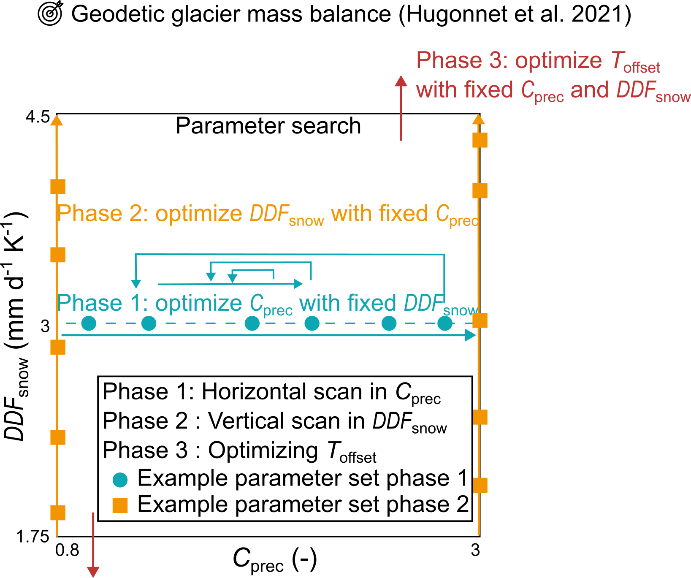

# Calibration on Geodetic Mass Balance

In this calibration, the target is the **geodetic glacier mass balance** over a certain time period. This is a calibration that is typically used for Global Glacier Models.

The calibration process in GloGEM involves looping through **three calibration phases** in sequence:

1. **Calibration Phase 1: `cprec`** — Precipitation correction factor  
2. **Calibration Phase 2: `ddfsnow`** — Melt factor for snow (ddfice is defined as 2x ddfsnow)  
3. **Calibration Phase 3: `toff`** — Temperature offset (bias)

Each glacier is calibrated individually using the reanalysis product specified in the `config.pro` file. Parameter boundaries can be defined either in `config.pro` or by referring to the **reanalysis-specific** `regional_parameter` file.

## Data Sources

- For RGIv6: **Geodetic Mass Balance**: [Hugonnet et al., 2021](https://www.nature.com/articles/s41586-021-03436-z), for the period 2000–2020 or 2000-2010 or 2010-2020.
- For RGIv7: - not available so far
 
---

## Calibration Phases

### Phase 1: Calibrate `cprec`

- The default range is typically **[0.8 – 2.5]**.
- Calibration starts with a fixed `ddf_snow = 3` (`ddf_ice = 2 × ddf_snow`).
- If the geodetic mass balance target is met with some combination of `cprec` and `ddf = 3`, the calibration ends here.
- If not, move to Phase 2.
- When transitioning to Phase 2, `cprec` is fixed at one of the **boundary values**, depending on which side is closest to the best-fitting value from Phase 1.

### Phase 2: Calibrate `ddf`

- `ddf` is now varied freely within its defined range (default in GloGEM: **[1.5 – 4.5]**).
- `cprec` remains fixed at a boundary value.
- If the target is still not matched, the process proceeds to Phase 3.

### Phase 3: Calibrate `toff`

- This phase adjusts the **temperature time series** using an offset.
- Only performed if both `cprec` and `ddf` fail to yield a sufficient match with the geodetic target.

---

Calibration on Geodetic Mass Balance calibration scheme. Overview of the three calibration phases.

