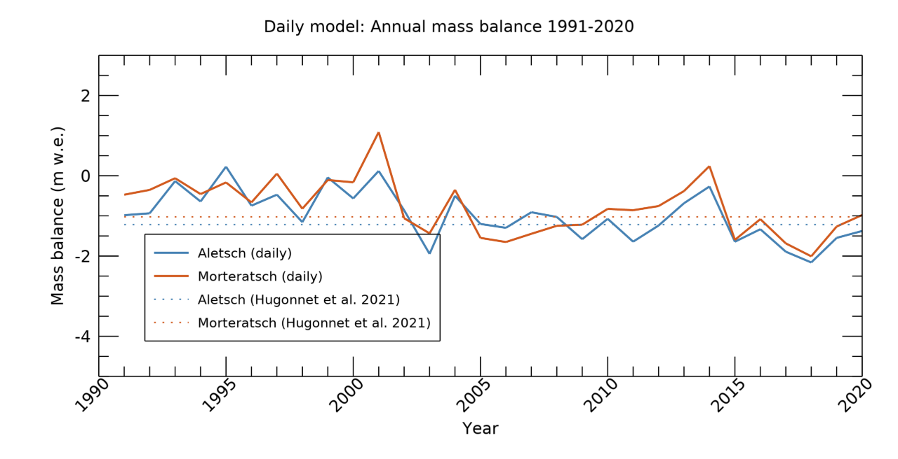
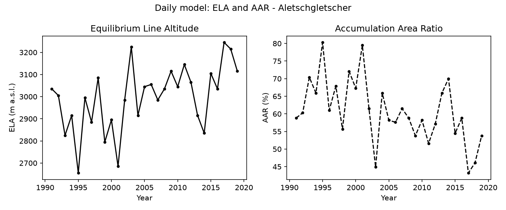
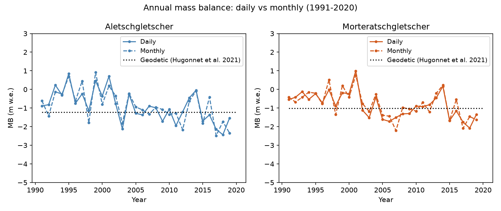
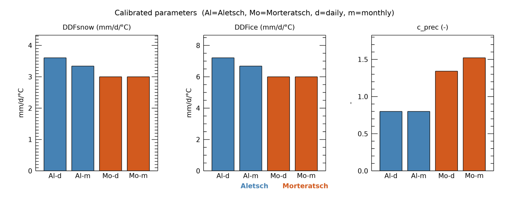

# Quickstart — test run

**Test run on Aletsch & Morteratsch**

This guide runs GloGEM on two well-measured Swiss Alpine glaciers using a
minimal dataset that is **bundled with the repository**. No access to
external data shares is required.

| Glacier | RGI ID | Area |
|---------|--------|------|
| Aletschgletscher | RGI70-11.02596 | 82 km² |
| Morteratschgletscher | RGI70-11.02216 | 16 km² |

The test covers:
- daily model calibration and hindcast (1991–2020)
- monthly model calibration and hindcast (1991–2020)

Calibration finds the glacier-specific parameters; the hindcast then runs
the full period with those parameters to produce time series that can be
compared against observations.

Expected total runtime: **~70 seconds** on a modern workstation.

---

## Prerequisites

- IDL 9.0 or later
- The GloGEM repository cloned and the working directory set to its root:

```bash
git clone https://github.com/eth-vaw-glaciology/GloGEM.git
cd GloGEM
```

---

## Step 1 — Daily calibration

Copy the test config to the repository root, then start IDL and run the model:

```bash
cp test/config_aletsch_daily_calib.pro config.pro
idl
```

```idl
.r glogem
```

The model adjusts three parameters per glacier — precipitation correction
factor (`c_prec`), degree-day factor for snow (`DDFsnow`), and for ice
(`DDFice`) — against the 2000–2020 geodetic mass balance from
Hugonnet et al. (2021).

**Expected output** (~58 s):

```
We are running GloGEM daily
Calibration started ...
Catchment selection: Aletsch_Morteratsch
...
FINISHED region !!! centraleurope !!!
```

Calibration results are written to:

```
test/outputs/daily/CentralEurope/calibration/
  calibrate_m1_cID9_centraleurope_final_era5_Aletsch_Morteratsch.dat
```

Typical calibrated values:

| Glacier | Ba (m w.e. a⁻¹) | ELA (m) | AAR (%) | DDFsnow | DDFice | c_prec |
|---------|-----------------|---------|---------|---------|--------|--------|
| Aletsch | −1.17 | 3100 | 54 | 3.6 | 7.2 | 0.80 |
| Morteratsch | −0.97 | 3060 | 48 | 3.0 | 6.0 | 1.34 |

---

```{note}
After each step, exit IDL (`exit`), copy the next config in your terminal,
and relaunch IDL with `.r glogem`.
Restarting avoids stale variables from the previous run carrying over.
```

## Step 2 — Daily hindcast

Using the calibrated parameters from Step 1, run the full 1991–2020 time series.
In your terminal:

```bash
cp test/config_aletsch_daily_hindcast.pro config.pro
```

Then in IDL:

```idl
.r glogem
```

**Expected output** (~6 s):

```
We are running GloGEM daily
Running for the future ...
FINISHED region !!! centraleurope !!!
```

Annual time-series files are written to:

```
test/outputs/daily/CentralEurope/PAST/PAST_original/
  centraleurope_Annual_Balance_sfc_r1_Aletsch_Morteratsch.dat
  centraleurope_ELA_r1_Aletsch_Morteratsch.dat
  centraleurope_AAR_r1_Aletsch_Morteratsch.dat
  centraleurope_Area_r1_Aletsch_Morteratsch.dat
  centraleurope_Volume_r1_Aletsch_Morteratsch.dat
  ... (one file per output variable)
```

---

## Step 3 — Monthly calibration

In your terminal:

```bash
cp test/config_aletsch_monthly_calib.pro config.pro
```

Then in IDL:

```idl
.r glogem
```

The monthly model reads gridded ERA5 climate fields and applies a
sub-monthly variability correction. Calibration is otherwise identical
to the daily model.

**Expected output** (~5 s):

```
We are running GloGEM monthly
Calibration started ...
FINISHED region !!! centraleurope !!!
```

Typical calibrated values:

| Glacier | Ba (m w.e. a⁻¹) | ELA (m) | DDFsnow | DDFice | c_prec |
|---------|-----------------|---------|---------|--------|--------|
| Aletsch | −1.17 | 3143 | 3.7 | 7.4 | 0.80 |
| Morteratsch | −0.98 | 3116 | 3.0 | 6.0 | 1.36 |

---

## Step 4 — Monthly hindcast

In your terminal:

```bash
cp test/config_aletsch_monthly_hindcast.pro config.pro
```

Then in IDL:

```idl
.r glogem
```

**Expected output** (~1 s):

```
We are running GloGEM monthly
Running for the future ...
FINISHED region !!! centraleurope !!!
```

---

## Visualising results

After completing all four runs, open the visualisation notebook in VS Code
(requires the IDL extension):

```
test/visualise_test_results.idlnb
```

The notebook auto-detects its own location — no path setup is needed.
It reads the outputs from `test/outputs/` and produces four plots:

**Plot 1 — Annual mass balance (1991–2020)**



**Plot 2 — Equilibrium line altitude and accumulation area ratio (daily)**



**Plot 3 — Daily vs monthly model comparison**



**Plot 4 — Calibrated parameters**



It also runs 11 automated sanity checks. All should pass if the model is
set up correctly.

---

## Expected sanity check results

```
PASS  Aletsch   daily  Ba:  -1.167  [expected -1.50 to -0.80]
PASS  Morteratsch daily  Ba:  -0.968  [expected -1.40 to -0.50]
PASS  Aletsch   monthly Ba:  -1.169  [expected -1.50 to -0.80]
PASS  Morteratsch monthly Ba:  -0.980  [expected -1.40 to -0.50]
PASS  Aletsch daily DDFsnow:   3.606  [expected  1.50 to  7.50]
PASS  Aletsch daily DDFice:    7.212  [expected  3.00 to 15.00]
PASS  Aletsch   daily  mean Ba 2000-2020:  -1.xxx  [expected -1.50 to -0.80]
...
11 / 11 checks passed — the model is working correctly!
```

---

## What the test configs change

Each config file follows the same format as `config.pro.example` with only the
test-specific lines uncommented. Compared to default settings, the tests change:

| Setting | Value | Reason |
|---------|-------|--------|
| `dirres` | `base_dir + '/test/outputs/'` | write to repo-local folder |
| `main_dir`, `dir`, `dir_clim` | `base_dir + '/test/...'` | use bundled minimal dataset |
| `RGIversion` | `'7'` | required for bundled band files |
| `catchment_selection` | `'Aletsch_Morteratsch'` | two-glacier subset |
| `tran` | `[1991, 2020]` | shorter period matching bundled climate data |
| `glacier_retreat` | `'n'` | disabled — no retreat geometry data bundled |
| `frontal_ablation` | `'n'` | disabled — no calving for these land-terminating glaciers |

All paths use `base_dir` (set automatically by `glogem.pro` from the
current working directory), so the configs work regardless of where the
repository is cloned.

---

## Troubleshooting

**"Parameter-File for centraleurope is not available"**
: Run Step 1 (daily calibration) before Step 2 (daily hindcast), and
  Step 3 (monthly calibration) before Step 4 (monthly hindcast). The
  hindcast reads calibration parameters produced by the preceding step.

**Model finishes but output files are missing**
: Check the log file in `logs/` for errors. Common causes are incorrect
  `dirres` or missing data files in `test/data/`.

**Sanity check fails for Ba**
: The geodetic calibration target is the 2000–2020 mean from Hugonnet
  et al. (2021). A Ba outside the expected range by more than 0.3 m w.e. a⁻¹
  usually indicates that the calibration run (Step 1 or 3) did not complete
  correctly or that `read_parameters` was set to `'y'` before calibration.
