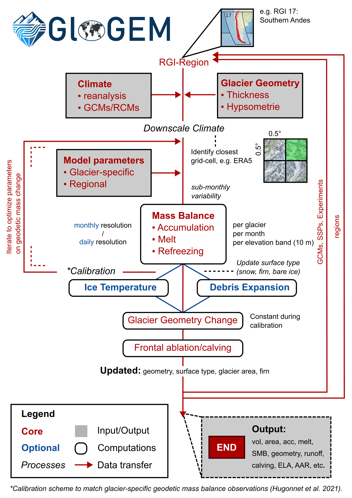

# Model Description

## Overview

GloGEM is a glacier-centric model: it simulates each of Earth's ~200,000 glaciers independently, using individual elevation-band (hypsometry) files derived from the Randolph Glacier Inventory (RGI). For glacier complexes, ice divides from the inventory separate individual glacier entities so that all ice in a basin flows towards a single terminus.

The model is forced by gridded near-surface air temperature and precipitation. For the historical period this comes from reanalysis products; for future projections from bias-corrected GCM output. Climate fields are extrapolated from the nearest grid point to each glacier's elevation bands using temperature lapse rates and a precipitation gradient.

## Schematic overview

## Model components

| Component | Description |
|-----------|-------------|
| [Mass balance](mass-balance/index.md) | Accumulation, melt, refreezing, and optional firn/ice temperatures per elevation band |
| [Glacier retreat](glacier-dynamics/retreat-model.md) | Volume–area–length scaling to update glacier geometry annually |
| [Calving](glacier-dynamics/calving-model.md) | Frontal ablation for marine-terminating glaciers |
| [Debris model](debris-model.md) | Evolution of supraglacial debris cover and its effect on melt |
| [Solar radiation](solar-radiation.md) | Potential shortwave radiation for the energy-balance melt model |
