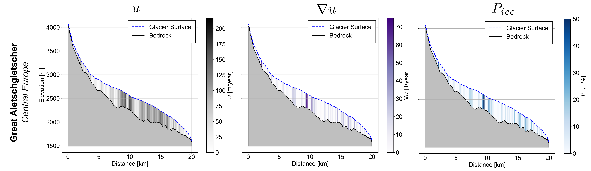

# Firn and Ice Temperature

The englacial temperature model computes vertical temperature profiles per elevation band throughout the firn and ice column. It is optional and activated with `firnice_temperature = 'y'` in `settings.pro`. The model is implemented in `procedures/processing/firnice_temperature_model.pro`.

## Overview

The figure below shows a schematic of the model. Heat conduction is solved through a 1-D vertical column per elevation band, with monthly mean air temperature as the upper boundary and geothermal heat flux at the base.

## Heat conduction

Englacial temperature evolution is governed by the heat diffusion equation:

$$
\frac{\partial T_{i,m}}{\partial t} = \frac{1}{c_h \cdot \rho} \frac{\partial}{\partial z}\left(\kappa \frac{\partial T_{i,m}}{\partial z}\right)
$$

where $c_h$ is the heat capacity, $\kappa$ the thermal conductivity, and $\rho$ the firn/ice density. The temperature of the uppermost layer equals the monthly mean air temperature.

### Vertical grid

To reduce computational cost, layer resolution decreases with depth:

| Depth range | Layer thickness |
|-------------|----------------|
| 0–10 m | 1 m |
| 10–60 m | 5 m |
| 60–260 m | 20 m |

This is configured via `fit_layers = [10, 10, 10]` and `fit_dzstep = [1., 5., 20.]`.

At the lower boundary, a geothermal heat flux from the gridded dataset of Lucazeau (2019) is applied.

## Refreezing and latent heat

Refreezing and the associated latent heat transfer from percolating meltwater follow the scheme described in [Refreezing](refreezing.md). Before entering the ice, the water input is reduced because ice is largely impermeable. However, heavily crevassed areas are treated as more permeable, as fractures provide pathways for liquid water infiltration.

## Ice permeability from velocity gradients

Crevassed regions are approximated using ice velocity gradients. Horizontal ice velocity is estimated with the Shallow Ice Approximation (SIA):

$$
u_i = \frac{2A}{n+1} \left(\rho g \sin\theta_i\right)^n H_i^{n+1}
$$

where $A$ is the flow rate factor (temperature-dependent), $n$ is Glen's flow law exponent, $\theta_i$ is the surface slope, and $H_i$ is the ice thickness. The velocity gradient $\nabla_u$ is computed by finite differences and normalised:

$$
\nabla_{u,\text{norm}} = \frac{\nabla_u - \min(\nabla_u)}{\max(\nabla_u) - \min(\nabla_u)}
$$

Positive velocity gradients (extensional flow) serve as a proxy for crevassing and are used to derive a permeability factor $P_i$. The maximum permeability is capped at 50% — fully permeable ice is not assumed.

The figure below shows the step-by-step computation for Aletschgletscher:

## Settings

| Setting | Default | Description |
|---------|---------|-------------|
| `firnice_temperature` | `'n'` | Activate the englacial temperature model |
| `firnice_write` | `['y','y']` | Write overall time series and detailed profiles |
| `firnice_batch` | `'y'` | Run for all sites in `icetemperature_batch.dat` |
| `firnice_profile` | `[0.2, 0.65, 0.95]` | Elevation fractions (or m a.s.l.) for output profiles |
| `enable_advection` | `'n'` | Activate horizontal advection of temperature |
| `firn_permeability` | `'y'` | Enable water percolation into firn |
| `ice_permeability` | `'n'` | Enable water percolation into ice (via velocity gradients) |
| `fit_layers` | `[10, 10, 10]` | Number of layers per thickness group |
| `fit_dzstep` | `[1., 5., 20.]` | Layer thickness per group [m] |

## Inputs

| Name | Type | Description |
|------|------|-------------|
| `firn` | Array | Firn cover per elevation band |
| `sno` | Array | Snow storage per elevation band |
| `tgs` | Array | Surface air temperature |
| `plg` | Array | Precipitation per grid point |
| `mel` | Array | Melt per grid point |
| `fit_water` | Array | Liquid water available from melt and precipitation |
| `firnice_maxdepth` | Numeric | Maximum depth for firn/ice profile |
| `geothermal_flux` | Array | Geothermal heat flux at glacier base [one value per glacier] |
| `slope` | Array | Surface slope per elevation band |
| `thick` | Array | Ice thickness per elevation band |
| `fit_dens` | Array | Reference density profile [kg m⁻³] |
| `kice`, `kair` | Constants | Thermal conductivity of ice and air |
| `cice`, `cair` | Constants | Heat capacity of ice and air |

## Outputs

| Variable | Description |
|----------|-------------|
| `elev_firnicetemp(0)` | Englacial temperature at 2 m depth, all elevation bands |
| `elev_firnicetemp(1)` | Englacial temperature at 10 m depth, all elevation bands |
| `elev_firnicetemp(2)` | Englacial temperature at 50 m depth, all elevation bands |
| `elev_firnicetemp(3)` | Englacial temperature at bedrock depth, all elevation bands |
| `firnice_profile_ind(0,j)` | Full vertical temperature profile per elevation band |
